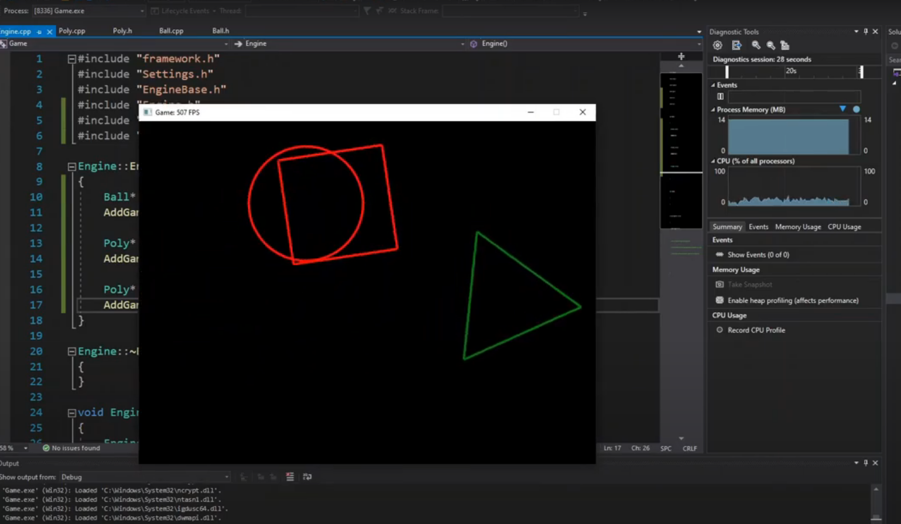
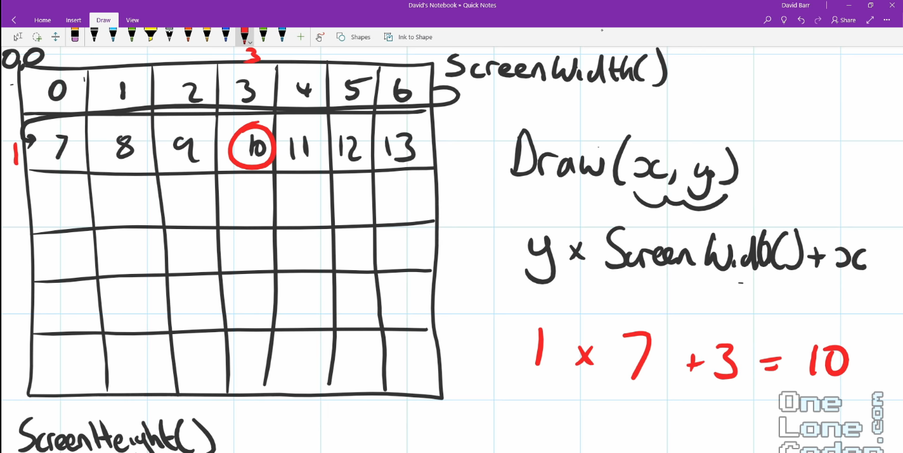
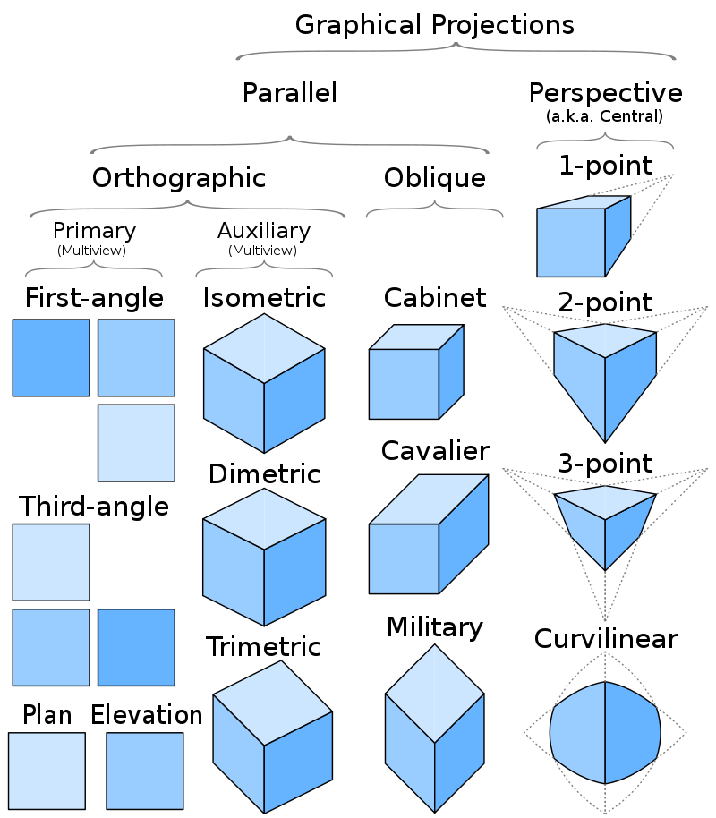
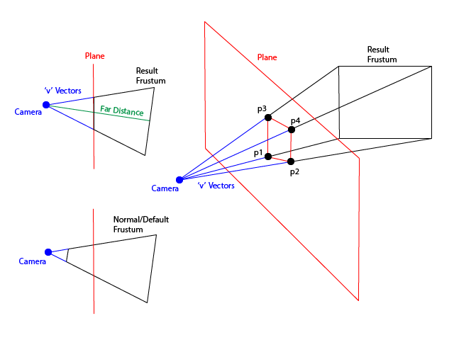
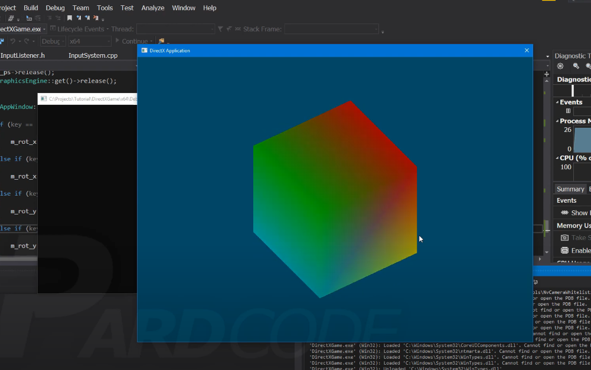

# 3D Projection Engine

## Proposal Structure:
The proposal will include the following sections:
* **Project Title:** 3D Projection Engine 
* **Description:** This program uses self-implemented graphic library to
  1. projects a 3D illusion into a 2D plane ([checkpoint 1](#checkpoint-1))
  2. by drawing inclined or declined lines from  coordinates or vertices in a certain angle from a perspective point ([checkpoint 2](#checkpoint-2))
  3. to make a 3D object for detailed method please read the detail [below](#detailed-description). ([checkpoint 3](#checkpoint-3))
* **Team Members:** 
  * Phobphoomin Siriboon (64011548)
  * Mahnun Saratunti (64011456)

## Detailed Description:

Please read the simplified description above first.

### Project Structure

This program consists mainly of 2 parts:
* [3D engine](#3d-engine)
* [graphic library](#graphic-library)

#### 3D Engine

##### Checkpoint 1
We first need a console engine that creates a 'blank' window application from win32 api,directx or any other optional libary (in our case, our own simple library) in order to show us the output/result and serve us as a GUI for example olcgameengine window which is made up of 6base number 6x6 array in which each array is translated from a coordinate(x,y) with the following formula: 
array[i] = y *(i in range (x,y)) + x 

##### Checkpoint 2

Next we need a base engine from any graphical libary composed of functions that has a mathematics formula that receives our parameter/input and logic to translate the variable and calculate the "object" and  "projection" output for us. For more detail about the method please read the documentation provided [below](#documentation).

##### Checkpoint 3

Finally we can observe the outcome from our designated "perspective", also we can make the object dynamic by constantly updating its position precisely using "matrix rotation" and mathematics.
* Room for improvement \
Additionally a camera can be made by constantly updating our "perspective" upon WASD input thus ray-casting and ray-tracing is possible to make up a viable first person game also we can add texture to the object or import a texture by reading a FILE which contains our desired parameter(input) in a specified format (example, .obj file).

#### Graphic Library

We will implement a simple terminal graphic library to display the projected 3D illusion onto the terminal. This graphic library is cross platform (will be tested on Mac's terminal and Windows' command prompt) as long as the terminal has support for unicode. The library will be included in this repo, meaning the 3D image projection can be displayed without the need of having to rely on any external graphic library. 

## Documentation:
* **ENGINE Example of a 2D Plane Window Application.** 

* **OBJECT 3D Projection method on a 2D plane.**

  \
P are vertices of the object
* **PERSPECTIVE Matrix relation with the object.**

*  **MATRIX ROTATION relation with object movement method.**

## Trivia, Reference and Requirements:
* C/C++ Optional Lbaries:
  * Graphic library 
  * OpenGL 
  * SFML 
  * DirectX 
  * olcgameengine https://www.youtube.com/watch?v=u5BhrA8ED0o&t=1080s&ab_channel=javidx9 
  * 2DgameEngine Derived from Direct2D 
* Recommended IDE: 
  * Visual Studio IDE 

## Example of the finalized project:

